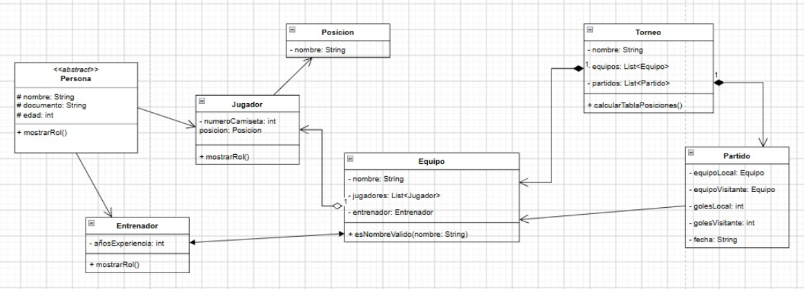

# Sistema de Gestión de Torneo Deportivo

## Integrantes
* Natalia Rolón Leal
* Sara

---

## Descripción Breve del Sistema
Este sistema es una aplicación de consola desarrollada en **Java** bajo el paradigma de **Programación Orientada a Objetos (POO)**. Permite administrar de forma integral un torneo deportivo, ofreciendo funcionalidades para:
* Crear y configurar un torneo.
* Registrar equipos participantes.
* Registrar jugadores y entrenadores asociados a cada equipo.
* Programar y registrar resultados de partidos entre equipos.
* Calcular y visualizar dinámicamente la tabla de posiciones (puntos, partidos jugados, ganados, empatados, perdidos, goles a favor/contra y diferencia).
* Buscar jugadores por nombre de forma insensible a mayúsculas/minúsculas.
* Generar reportes finales detallados utilizando `StringBuilder`.

---

## Instrucciones para Ejecutarlo

1. **Requisitos previos:**
   * Tener instalado **Java JDK** (versión 25 o superior recomendada).
   * Tener instalado un entorno de desarrollo compatible como **Apache NetBeans IDE**.

2. **Pasos para la ejecución:**
   * Clona o descarga este repositorio en tu computadora.
   * Abre **Apache NetBeans** y selecciona **File > Open Project** para cargar la carpeta del proyecto.
   * Asegúrate de que el proyecto esté configurado con las dependencias correctas (Maven o proyecto Java estándar según corresponda).
   * Ubica la clase principal: 
     `com.mycompany.sistema_gestion_torneo_deportivo.Sistema_Gestion_Torneo_Deportivo`
   * Haz clic derecho sobre la clase principal y selecciona **Run File** (o presiona `Shift + F6`).
   * Sigue las instrucciones del menú interactivo en la consola.

---

## Diagrama de Clases

---

## Explicación de Relaciones entre Clases

A continuación se detalla la relación elegida para cada par de clases y el fundamento de su diseño:

1. **`Torneo` y `Equipo` (Agregación / Composición):**
   * *Relación:* Un `Torneo` contiene una lista de objetos `Equipo` (`List<Equipo>`).
   * *Por qué:* Un torneo está compuesto por múltiples equipos. Si el torneo deja de existir, los equipos conceptualmente pueden existir de forma independiente, pero dentro del sistema el torneo actúa como el contenedor principal de la competencia.

2. **`Equipo` y `Jugador` / `Entrenador` (Composición):**
   * *Relación:* Un `Equipo` administra colecciones de `Jugador` (`List<Jugador>`) y objetos de tipo `Entrenador`.
   * *Por qué:* Los deportistas y entrenadores pertenecen orgánicamente a una institución deportiva. Su gestión de altas y validaciones depende directamente del equipo al que se están asociando.

3. **`Jugador` y `Posicion` (Asociación / Composición):**
   * *Relación:* Cada `Jugador` tiene un atributo de tipo `Posicion` (ej. Delantero, Portero).
   * *Por qué:* Permite modelar de manera limpia y modular el rol táctico específico que desempeña el deportista dentro del terreno de juego, separando la entidad conceptual de la posición.

4. **`Torneo` y `Partido` (Composición):**
   * *Relación:* El `Torneo` almacena y gestiona el calendario de encuentros mediante una lista de `Partido` (`List<Partido>`).
   * *Por qué:* Los partidos no ocurren en el vacío; pertenecen estrictamente a la calendarización de ese torneo en particular, y a través de ellos se calculan posteriormente las estadísticas y la tabla de posiciones.

5. **`Partido` y `Equipo` (Asociación):**
   * *Relación:* Un `Partido` hace referencia a dos `Equipo`s distintos: un equipo local y un equipo visitante.
   * *Por qué:* Para llevar a cabo un encuentro deportivo y registrar sus goles es indispensable enlazar lógicamente a los dos contrincantes que se enfrentan en dicha fecha.